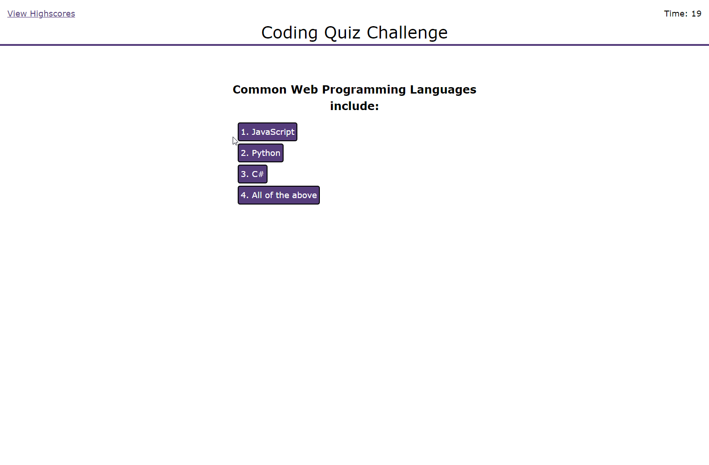

# Coding Quiz - Module04 Challenge
UofU-VIRT-FSF-PT-07-2022-U-LOLC-MWTH Module 4 Code Challenge

## Completed Mockup
This is a multiple choice timed quiz game to challenge users on their coding knowledge. Users can complete for high scores by answering questions correctly in as fast a time as possible.

Live URL: [https://icunningham7.github.io/Coding-Quiz---module04-challenge/](https://icunningham7.github.io/Coding-Quiz---module04-challenge/)

Mockup Preview Image:



## Project Requirements

## User Story

```
AS A coding boot camp student
I WANT to take a timed quiz on JavaScript fundamentals that stores high scores
SO THAT I can gauge my progress compared to my peers
```

## Acceptance Criteria

```
GIVEN I am taking a code quiz
WHEN I click the start button
THEN a timer starts and I am presented with a question
WHEN I answer a question
THEN I am presented with another question
WHEN I answer a question incorrectly
THEN time is subtracted from the clock
WHEN all questions are answered or the timer reaches 0
THEN the game is over
WHEN the game is over
THEN I can save my initials and my score
```
